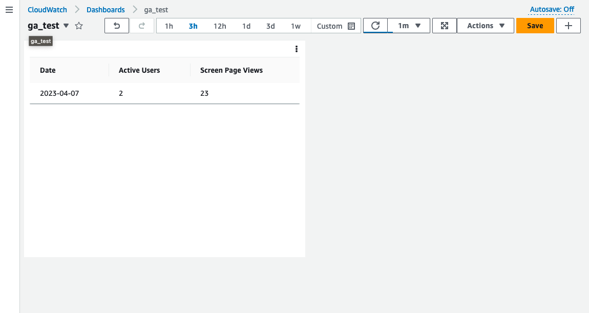

# Description
Toy project to get data from google analytics and return it as html table to show it in custom CloudWatch widget. 

Note: Custom CloudWatch widget doesn't allow any js code, so it's not a graph, but table

GA credentials are stored in AWS SecretsManager (hardcoded). 



[Report example](./docs/html_report_example.html)

## Setup
Prepare env and install dependencies
```
python3 -m venv .venv
source .venv/bin/activate
pip install -r requirements.txt
```

Synthesize the CloudFormation template for this code.

```
cdk synth
```

Deploy (given aws credentials already setup)

```shell
cdk deploy
```
