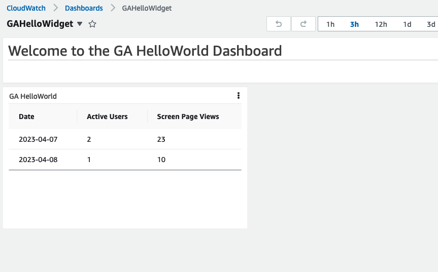

# Description
App gets data from google analytics V4 and shows it in custom AWS CloudWatch widget. 

Note: Custom CloudWatch widget doesn't allow any js code, so it's not a graph, but table



[Report example](./docs/html_report_example.html)

## Prerequisites
- website with installed Google Analytics V4 property
- credentials for Service account in GCP, which has access to Google Analytics property (See Appendix A for details)
- credentials(json key) are store in AWS Secrets Manager. Secret name hardcoded in `src/index.py`

## Setup
Prepare env and install dependencies
```
python3 -m venv .venv
source .venv/bin/activate
pip install -r requirements.txt
```

Install and run Docker

Synthesize the CloudFormation template for this code.
```
cdk synth
```

Deploy (given aws credentials already setup)

```shell
cdk deploy
```

## Appendix A (prerequisites):

1. Set up a Google API project:
   1. Go to the Google Cloud Console: https://console.cloud.google.com/
   2. Create a new project or select an existing one. 
   3. Navigate to the "APIs & Services" dashboard, and click on "ENABLE APIS AND SERVICES."
   4. Search for "Google Analytics Reporting API" and enable it.
2. Create credentials for your Python application:
   1. In the "APIs & Services" dashboard, click on "Credentials."
   2. Click "CREATE CREDENTIALS" and select "Service account."
   3. Fill in the required details, and click "CREATE AND CONTINUE."
   4. Grant the necessary permissions (e.g., "Editor") and click "CONTINUE."
   5. Click "DONE" to finish creating the service account. 
   6. Click on the newly created service account, navigate to the "KEYS" tab, and click "ADD KEY." Choose "JSON" and download the JSON key file. Keep this file secure, as it contains sensitive information. 
3. Add the service account email to your Google Analytics account:
   1. Log in to your Google Analytics account: https://analytics.google.com/
   2. Go to the "Admin" panel (the gear icon in the lower-left corner). 
   3. In the "Account" column, click "Account User Management" and add the service account email with "Read & Analyze" permissions. 